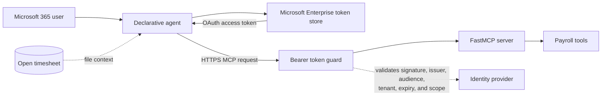

# Contoso Payroll MCP for Microsoft 365 Copilot

A reference implementation of a **remote MCP server**, **Microsoft 365 Copilot
declarative agent**, **OAuthPluginVault authentication**, and a folder-based
**Agent Skill**.

The fictional Contoso Payroll scenario demonstrates how an ISV can host one MCP
service and distribute an agent to customer tenants. The payroll calculations
are illustrative and are not tax advice.

## What this repository demonstrates

- Streamable HTTP MCP with six structured, read-only payroll tools.
- A Microsoft 365 Copilot declarative agent that invokes the remote MCP server.
- A working `SKILL.md` workflow loaded through `agent_skills`.
- Microsoft Entra SSO and third-party OAuth security patterns.
- Cross-tenant OAuth vault configuration and common `OAuthPluginVault` failures.
- Azure Container Apps deployment with fail-closed authentication.



## Tested manifest combination

Agent Skills activated successfully with:

| Artifact | Version/property |
| --- | --- |
| Microsoft 365 app manifest | `manifestVersion: "1.29"` |
| Declarative agent manifest | `version: "v1.8"` |
| Skill declaration | `agent_skills[].folder` |
| Skill file | `skills/payroll-variance-review/SKILL.md` |

The app manifest version and declarative-agent version are independent. A common
failure is updating the `$schema` URL while leaving `version` at an older value.

The proof prompt is:

> Do a variance review of this payroll run

A successful runtime load begins with:

```text
[SKILL-ACTIVE] payroll-variance-review v1
```

Agent Skills support is evolving quickly. Use a current Microsoft 365 Agents
Toolkit release and verify both package acceptance and runtime activation in the
target tenant.

## Repository layout

```text
.
├── appPackage/
│   ├── manifest.json
│   ├── declarativeAgent.json
│   ├── ai-plugin.json
│   ├── instruction.txt
│   └── skills/payroll-variance-review/SKILL.md
├── docs/mcp-security.md
├── env/.env.dev.example
├── m365agents.yml
├── scripts/
│   ├── build_package.sh
│   └── deploy_azure.sh
└── server/
    ├── payroll_mcp/
    ├── scripts/smoke_test.py
    ├── Dockerfile
    └── requirements.txt
```

## MCP tools

| Tool | Purpose |
| --- | --- |
| `get_sample_timesheet` | Return synthetic payroll data for a no-file demo |
| `process_payroll` | Calculate gross pay, deductions, tax, net, and funding |
| `check_payroll` | Detect missing data, duplicates, low rates, and pay anomalies |
| `explain_paycheck` | Explain one employee's gross-to-net calculation |
| `tax_summary` | Summarize withholding, employer tax, deposits, and filings |
| `get_run_summary` | Recap the authenticated user's most recent demo run |

## Run locally

Requires Python 3.11 or newer.

```bash
cd server
python -m venv .venv
source .venv/bin/activate
pip install -r requirements.txt
cp .env.example .env
python -m uvicorn payroll_mcp.server:app --port 3978
```

In another terminal:

```bash
cd server
source .venv/bin/activate
python -m unittest discover -s tests
python scripts/smoke_test.py
```

Local authentication is off by default. Never carry that setting into a public
deployment.

## Configure the agent package

```bash
cp env/.env.dev.example env/.env.dev
```

Set:

- `TEAMS_APP_ID`: stable Microsoft 365 app ID.
- `MCP_BASE_URL`: service origin, without `/mcp`.
- `MCP_ENDPOINT_URL`: Streamable HTTP endpoint, including `/mcp`.
- `AAD_APP_CLIENT_ID`: Entra application exposing the MCP API.

For an authenticated package, provision the OAuth registration:

```bash
atk auth login m365
atk provision --env dev
```

Agents Toolkit writes `OAUTH_REGISTRATION_ID` to `env/.env.dev`. The plugin
manifest references that opaque value byte-for-byte. Do not decode, reconstruct,
or transform it.

Build the package:

```bash
./scripts/build_package.sh
```

Output:

```text
appPackage/build/ContosoPayroll.zip
```

The build verifies every declared skill folder contains `SKILL.md` and preserves
the folder paths in the ZIP. Set `SKIP_SKILLS=1` to build an A/B control package.

For the Agents Toolkit packager:

```bash
TEAMSFX_AGENT_SKILLS=true atk package \
  --manifest-file appPackage/manifest.json \
  --output-package-file appPackage/build/ContosoPayroll-atk.zip \
  --output-folder appPackage/build
```

## OAuth vault scope for cross-tenant apps

The authentication configuration is stored in the Microsoft Enterprise token
store. Its organization and app restrictions are evaluated **before** Copilot
contacts the MCP server.

For a marketplace or multi-tenant ISV package:

| Setting | Production guidance |
| --- | --- |
| Restrict usage by organization | **Any Microsoft 365 organization** |
| Restrict usage by app | **Existing Teams app ID** after the app ID is stable |
| OAuth flow | Authorization code; enable PKCE when supported |
| Base URL | Exact MCP service origin registered for the package |

Use **My organization only** only for a single-tenant development deployment. A
registration with that setting can work in the ISV tenant and return a lookup
404 in an external customer tenant.

## `OAuthPluginVault` troubleshooting

Authentication configuration lookup happens before MCP `initialize`,
`tools/list`, or `tools/call`. Therefore, a vault lookup failure is not evidence
that the remote MCP endpoint is unavailable.

| Symptom | Most likely cause |
| --- | --- |
| Organization policy/access message with HTTP 404 | Registration is scoped to the home organization |
| App ID mismatch with HTTP 404 | Registration is bound to a different app ID |
| No matching configuration/reference ID | Wrong, stale, deleted, or recreated auth config |
| Works in publisher tenant but not customer tenant | `My organization only` registration |
| HTTP 401 after the MCP request reaches the server | Token validation, audience, scope, issuer, or base-URL mismatch |

Collect both the working and failing ZIP files, the exact debug-card text, and a
HAR trace. Compare:

- app ID and package version;
- MCP URL and registered base URL;
- authorization type and exact reference ID;
- organization/app restrictions;
- OAuth endpoints, scopes, PKCE, and token exchange method.

Skill text differences do not cause OAuth configuration lookup failures because
skills load later in the runtime.

## Security

Read **[MCP security configuration](docs/mcp-security.md)** before deploying.
The guide covers:

- Entra SSO versus third-party OAuth;
- cross-tenant OAuth vault restrictions;
- access-token validation and tenant allowlists;
- TLS, Host/Origin validation, CORS, and ingress controls;
- secret storage and rotation;
- principal-scoped state and payroll-data logging;
- rate limiting, tool annotations, and incident diagnostics.

The server fails startup when authentication is enabled but incomplete. It does
not silently expose `/mcp`.

## Deploy to Azure Container Apps

The included deployment script uses Entra access tokens issued specifically for
the MCP API:

```bash
export RG=<resource-group>
export ACR=<registry-server>
export ENTRA_TENANT_ID=organizations
export ENTRA_AUDIENCES=<client-id>,api://<client-id>,<application-id-uri>
export ENTRA_REQUIRED_SCOPE=access_as_user
export ENTRA_ALLOWED_TENANTS=<comma-separated-customer-tenant-guids>

./scripts/deploy_azure.sh
```

For a single-tenant deployment, set `ENTRA_TENANT_ID` to that tenant GUID. For a
multi-tenant service, keep an explicit `ENTRA_ALLOWED_TENANTS` allowlist whenever
the business model permits it.

## Declarative Agent Skills versus Cowork skills

- This package uses declarative-agent `agent_skills` in
  `declarativeAgent.json`.
- Cowork packages use root-level `agentSkills` and `agentConnectors` in the
  Microsoft 365 app manifest.
- Both package `SKILL.md`, but their manifest locations and connector shapes are
  different.

Do not infer the product surface only from the presence of `SKILL.md`; inspect
the manifest structure.

## Disclaimer

This repository is an educational reference. It is not a production payroll
system, tax engine, compliance product, or security certification.
